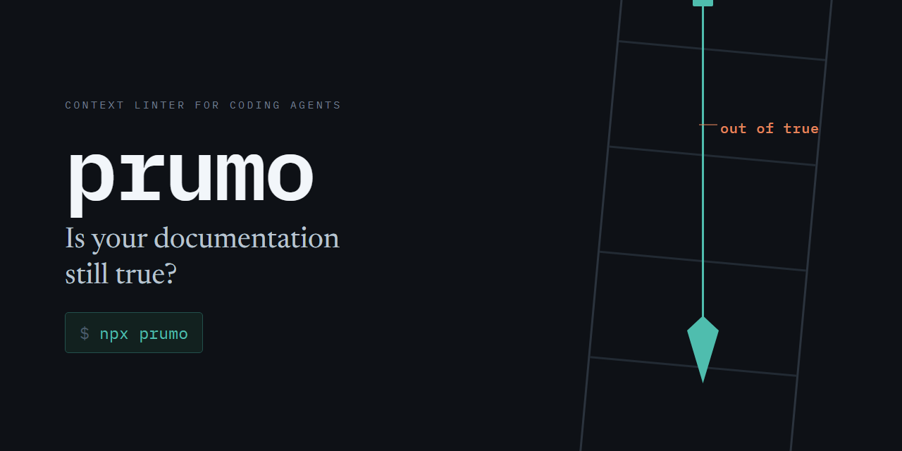

<p align="center">
  
</p>

<p align="center">
  Confere os arquivos de contexto que seu agente de código lê contra o código ao lado deles.
</p>

<p align="center">
  <a href="README.md">🇬🇧 Read in English</a>
</p>

---

## O problema

Há três meses alguém escreveu isto no `CLAUDE.md`:

```markdown
A logo da sidebar fica em `layouts/AppLayout.vue`.
```

De lá para cá a pasta foi renomeada para `Layouts`, com L maiúsculo. No Windows e no macOS aquele caminho continua abrindo, então nada nunca reclamou. No Linux e no CI ele aponta para o nada, e todo agente que lê o arquivo é mandado para um lugar que não existe.

Essa linha sobreviveu a seis auditorias feitas à mão nos mesmos arquivos. O prumo achou em quatro segundos.

---

## Começando

Você precisa de [Node.js 18+](https://nodejs.org) e `git`. Não há nada para instalar, configurar ou cadastrar.

Num terminal, dentro de qualquer repositório git:

```bash
npx @tomd4vs/prumo
```

O prumo localiza seus arquivos de contexto sozinho: `CLAUDE.md`, `AGENTS.md`, `.cursor/rules`, `.github/copilot-instructions.md`, skills instaladas em `.claude/skills/` e os demais. Todo arquivo e pasta que ele procura está na [referência](docs/reference.pt-BR.md#arquivos-encontrados-automaticamente).

---

## Lendo o resultado

Execução limpa:

```
prumo — 1 context file, 401 files in the git index

nothing to review.
```

Uma execução com achados, anotada:

```
prumo — 3 context files, 412 files in the git index           ← o que ele leu
        1 historical entry exempt from path checks            ← o que ele pulou de propósito

CASE MISMATCH  (1)   resolves on Windows and macOS, breaks on Linux and CI
  CLAUDE.md:18                                                ← arquivo e linha
      layouts/AppLayout.vue                                   ← o que a nota diz
      ->  resources/js/Layouts/AppLayout.vue                  ← o que o repositório tem

BROKEN LINK  (2)   1 with a likely destination
  CLAUDE.md:21  [[deploy-checklist]]   ->  deploy_checklist   ← o arquivo que provavelmente era
  CLAUDE.md:30  [[old-architecture]]                          ← sem candidato: renomeado ou apagado

MISSING PATH  (1)   paths cited to say they are gone were filtered out
  docs/setup.md:44  config/database.php                       ← arquivo, linha, caminho morto
      Copie o modelo para `config/database.php`…              ← a frase, para você julgar

4 to review                                                   ← 1 + 2 + 1
```

Todo achado traz arquivo, número da linha e a correção. Nada é adivinhado e nada é gravado. O que cada achado significa, e o que fazer com ele, está na [referência](docs/reference.pt-BR.md#o-que-cada-achado-significa). Se ele apontar uma linha que você sabe estar certa, [Silenciando um achado](docs/reference.pt-BR.md#silenciando-um-achado) mostra as duas formas de dizer isso.

---

## O que ele não faz

Três limites, escolhidos de propósito e explicados em [Design](docs/design.pt-BR.md):

- Não julga afirmações. Saber se *"esta flag desliga o cache"* continua verdade exige um modelo, e isso é outra ferramenta.
- Não edita além da capitalização. A sugestão de link é um palpite bem informado, e um caminho ausente pode estar ausente de propósito.
- Não faz chamada de rede. Sem telemetria, sem conta, sem modelo.

---

## Instalando

O `npx @tomd4vs/prumo` funciona sem instalar nada. Para uso frequente:

```bash
npm install -g @tomd4vs/prumo           # disponível em qualquer lugar da máquina
npm install --save-dev @tomd4vs/prumo   # ou como dependência de desenvolvimento de um projeto
```

Nos dois casos o comando é `prumo`. Node 18 ou mais novo, `git` no `PATH`, zero dependências. Erros nesta etapa, como um Node antigo ou uma pasta que não é repositório git, estão em [Resolvendo problemas](docs/troubleshooting.pt-BR.md).

---

## Usando a partir de um agente

O prumo é uma CLI comum, então qualquer agente com acesso a shell consegue rodá-lo.

**Peça ao agente para rodar.** `npx @tomd4vs/prumo` funciona em qualquer repositório git, e cobre sozinho as skills instaladas em `.claude/skills/`. Para um repositório que é ele mesmo uma skill, nomeie o arquivo: `npx @tomd4vs/prumo . SKILL.md`. A saída em texto traz arquivo, linha e correção, o que basta para um agente agir sem precisar interpretar nada. `--format json` devolve os mesmos achados como dados estruturados.

**Exponha como ferramenta.** O pacote também traz o `prumo-mcp`, um servidor MCP por stdio com duas ferramentas: `prumo_check`, que só lê, e `prumo_fix`, que reescreve a capitalização. No Claude Code:

```bash
claude mcp add prumo -- npx -y -p @tomd4vs/prumo prumo-mcp
```

A configuração para qualquer outro cliente MCP está em [Agentes](docs/agents.pt-BR.md#exponha-como-ferramenta).

**Crie um comando de barra.** Um arquivo em `.claude/commands/prumo.md` transforma a checagem em `/prumo`:

```markdown
Rode `npx @tomd4vs/prumo` e corrija todos os achados que ele reportar.
```

**Rode depois de cada edição.** Um hook `PostToolUse` roda o prumo sempre que o agente grava um arquivo de contexto, então os achados caem na transcrição e ele corrige na mesma rodada. O hook, em bash e em PowerShell, está em [Agentes](docs/agents.pt-BR.md#rode-automaticamente-depois-de-cada-edição).

---

## Integração contínua

O prumo sai com código diferente de zero quando acha algo, então entra em qualquer pipeline como um passo só:

```yaml
# .github/workflows/docs.yml
name: docs
on: [push, pull_request]
jobs:
  prumo:
    runs-on: ubuntu-latest
    steps:
      - uses: actions/checkout@v4
      - uses: actions/setup-node@v4
        with: { node-version: 20 }
      - run: npx @tomd4vs/prumo --quiet
```

Use o `actions/checkout` normalmente; o prumo lê o índice do git, então um checkout que o dispense não funciona. O `--format github` transforma os achados em anotações na linha exata do pull request. `--quiet`, `--format` e as demais opções estão na [referência](docs/reference.pt-BR.md#uso).

---

## Documentação

| Página | O que responde |
| --- | --- |
| [Referência](docs/reference.pt-BR.md) | Toda opção e código de saída, o que cada achado significa, como silenciar um, o que o `--fix` toca |
| [Agentes](docs/agents.pt-BR.md) | Cada integração por inteiro: o servidor MCP, o hook `PostToolUse` em bash e PowerShell, o comando de barra |
| [Design](docs/design.pt-BR.md) | Por que só três checagens: a medição que removeu a quarta, e os filtros que mantêm as outras caladas |
| [Resolvendo problemas](docs/troubleshooting.pt-BR.md) | Mensagens de erro, e as perguntas que as pessoas fazem antes de adotar |
| [API](docs/api.pt-BR.md) | Chamar a partir de código, e rodar a suíte de testes |

## Licença

MIT
